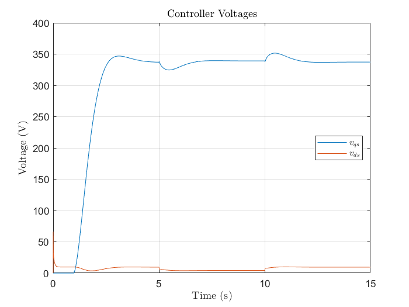
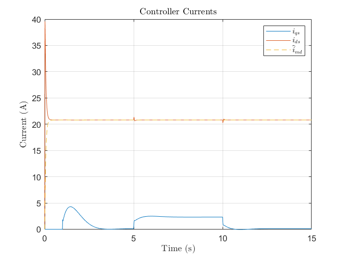
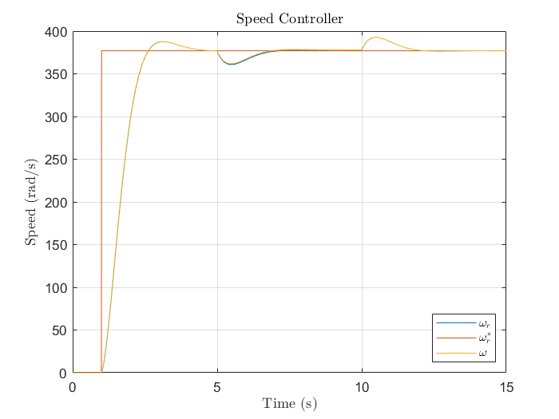
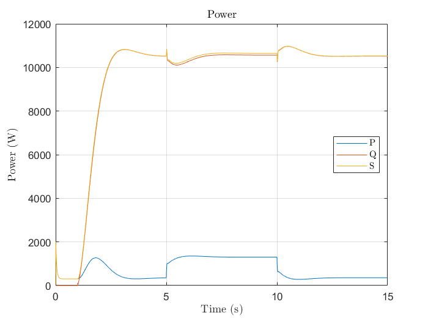

# ifoc

## Overview

**ifoc** is a simulation of a [Three-Phase Induction Motor (TIM)](https://en.wikipedia.org/wiki/Induction_motor) controled by a [Indirect Field Oriented Control (IFOC)](https://en.wikipedia.org/wiki/Vector_control_(motor)). It posseses the following characteristics:

- Developed with MATLAB R2019b;
- The simulation consists of the following files:
    - `simulation.m`: Main file of the simulation, with the configuration of some simulation parameters, administration of the simulation loop and plot of the graphs;
    - `parameters.m`: File with the parameters of the simulated motor (4cv 8-pole three-phase induction motor). These parameters were obtained experimentally from [no-load](https://en.wikipedia.org/wiki/Open-circuit_test) and [blocked rotor](https://en.wikipedia.org/wiki/Blocked_rotor_test) tests;
    - `IFOC.m`: Class with the implementation of the Indirect Field Oriented Control (IFOC);
    - `TIM.m`: Class for the simulation of the Three-Phase Induction Motor (TIM), using the [Runge-Kutta methods](https://en.wikipedia.org/wiki/Runge%E2%80%93Kutta_methods);
    - `PI.m`: Class with the implementation of the PI controller (see [PID Controller](https://en.wikipedia.org/wiki/PID_controller));
    - `PI_D.m`: Class with the implementation of the PI controller with filtered derivative action on feedback signal;
    - `Observer.m`: Class implementing a first order observer used by the IFOC algorithm to estimate rotor flux;
    - `FirstOrderFilter.m`: Class implementing a first order low-pass filter, used to filter the speed reference (set point);
- This library was used in the development of the following projects:
    - [Melhoria da robustez e eficiência em acionamentos de motores de indução trifásicos combinando as técnicas IFOC, LMC e MRAC](https://repositorio.utfpr.edu.br/jspui/bitstream/1/24529/1/melhoriarobustezeficienciamotores.pdf) (in brazilian portuguese);
    - [Reactive power based MRAC for robustness and efficiency improvements on a IFOC induction motor drive](https://ieeexplore.ieee.org/abstract/document/9067318);
    - [Adaptive Loss Model Control for robustness and efficiency improvement of induction motor drive](https://ieeexplore.ieee.org/abstract/document/9612111);

## Usage

Download this project and run the `simulation.m` script using your MATLAB. It should produce graphs like these:

